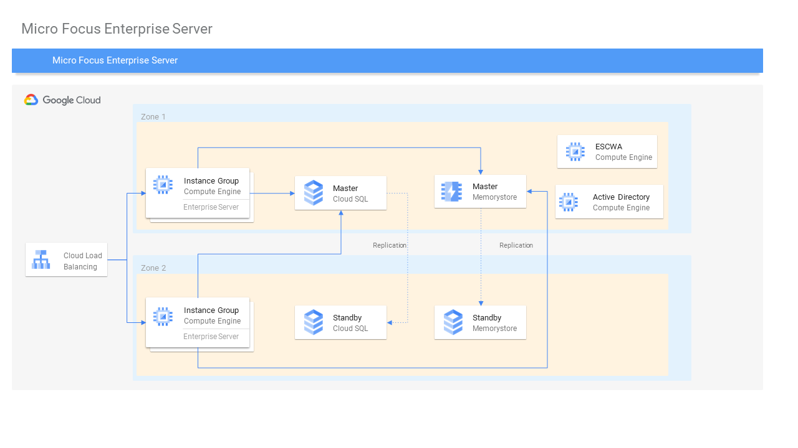

# rapiddeploy-microfocus-es

Automatically deploy [Microfocus Enterprise Server](https://www.microfocus.com/en-us/products/enterprise-server/overview) to Google Cloud. 

### Architecture Diagram



### Configurable Parameters

Parameter | Description 
--- | ---
project_id | The project to deploy to, if not set the default provider project is used
name | prefix to use for created resources
create_network | Whether to create a new VPC network to attach nodes to (default true). If this is false the vpc_network and vpc_subnet variables should specify an existing network and subnet to attach nodes to
vpc_network | Network to attach nodes to (only used if create_network is false)
vpc_subnet | Subnet to attach nodes to (only used if create_network is false) 
bucketname | Name of the bucket to create to upload scripts and the license file to
region | Region for cloud resources
availability_zones | Zone for cloud resources (if not specified first zone in region used)
redis_memory_size_gb | Memory size for redis server (default 1 GB)
vm_machine_type | Machine type to use for Enterprise Server instance nodes
escount | Number of ES nodes to create
storage_license_path | Google Storage Path of Enterprise Server license file
storage_setup_folder | Google Storage Folder where setup scripts are located
es_image_project | Project where Enterprise Server disk image is located
es_image_name | Name of Enterprise Server disk image
ad_image_name | Name of Active Directory machine image
pg_db_name | Name to give the postgresql database instance
pg_db_size | Size of the postgresql database
pg_db_username | Name of the postgresql database user to create
pg_db_password | Password that will be set for the created postgresql database user
ssh_ip | CIDR to lock access to instances

### Getting Started

#### Requirements
* Terraform v0.13.7+

#### Setup
1. Copy an Enterprise Server license file into the eslicense folder

#### Setup working directory
1. Copy placeholder vars file `variables.yaml` into new `terraform.tfvars` to hold your own settings.
2. Update placeholder values in `terraform.tfvars` to correspond to your GCP environment and desired settings. See [list of input parameters](#configurable-parameters) above.
3. Initialize Terraform working directory and download plugins by running `terraform init`.

#### Deploy Environment

```shell
$ terraform plan
$ terraform apply
```

#### Access Enterprise Server

Once Terraform completes:

1. Confirm Enteprise Server cluster is configured correctly with all nodes up & running:
  * Navigate to `https://<enterprise-server-escwa-ip>:10086`
  * Login
  * Go to Native tab
  * Confirm Directory Servers are running

2. Start Enterprise Server regions
  * Select the BNKDM region belonging to the first node and perform a cold start
  * Select the BNKDM region beloning to subsequent nodes and perform a regular start

3. Connect to the BankDemo application
  * Connect to the load balancer IP on port 5557 using a TN3270 client such as Rumba
  * The terminal should display "Welcome to CICS Option."
  * Clear the screen and enter BANK

### Cleanup

To delete resources created by Terraform, run the following commands:
``` shell
$ terraform state rm module.sql-db.google_sql_user.default[0]
$ terraform destroy
```

## License

This is not an officially supported Google product, though support will be provided on a best-effort basis.

```
Copyright 2021 Google LLC

Licensed under the Apache License, Version 2.0 (the "License");
you may not use this file except in compliance with the License.
You may obtain a copy of the License at

    https://www.apache.org/licenses/LICENSE-2.0

Unless required by applicable law or agreed to in writing, software
distributed under the License is distributed on an "AS IS" BASIS,
WITHOUT WARRANTIES OR CONDITIONS OF ANY KIND, either express or implied.
See the License for the specific language governing permissions and
limitations under the License.
